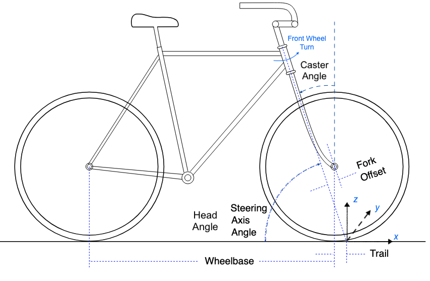
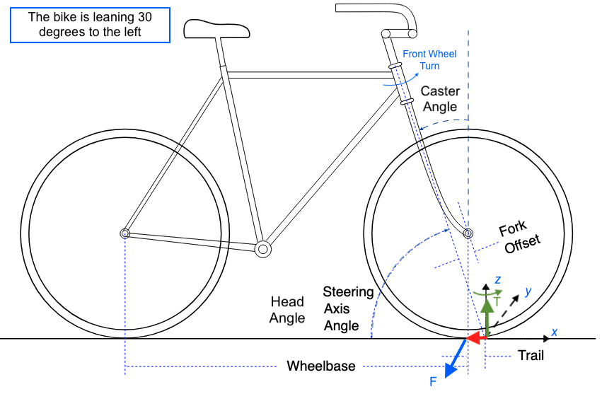

# How-a-Bike-Stays-Upright

## Calculating Torque Due to the Trail of a Leaning Bike (Approximation)

### Problem Statement
We will calculate the torque due to the trail of a bike leaning 30° to the left, with a trail of 10 cm, using vectors from scratch. We will:
- Define the x, y, z axes clearly.
- Compute the lever arm, force, and torque step-by-step.
- Ensure the result aligns with the expected leftward steering (counterclockwise about the steering axis).
- Address why we use the steering axis’ ground intersection.
- Explore the implications of the outcome.

### Step 1: Define the Coordinate System
- **Origin**: The point where the steering axis intersects the ground when the bike is upright.
- **Axes**:
  - x-axis: Forward along the bike’s direction of travel (positive ahead).
  - y-axis: Leftward, perpendicular to the bike’s plane (positive left).
  - z-axis: Upward, vertical when upright (positive up).
- **Lean**: The bike leans 30° to the left from vertical, tilting the frame toward the positive y-direction.
- **Steering Axis**: Angled ~70° from horizontal (~20° from vertical when upright), tilting with the lean.
- **Torque Direction Convention**:
  - Positive z-component = counterclockwise rotation (left turn) when viewed from above.
  - Negative z-component = clockwise (right turn).

### Step 2: Assumptions
- **Mass (m)**: 80 kg (bike + rider).
- **Gravity (g)**: 9.8 m/s², downward.
- **Trail (t)**: 0.1 m (distance from steering axis’ ground intersection to wheel contact point, fixed—no lean shortening).
- **Center of Gravity Height (h)**: 1 m above the ground when upright.
- **Steering Axis Angle (λ)**: 70° from horizontal (20° from vertical, upright).

### Step 3: Lever Arm Vector (r)
The lever arm is the vector from the pivot point (steering axis’ ground intersection) to where the force applies.

- **Trail Position**: The wheel contacts the ground 0.1 m behind the steering axis intersection.

- **Upright Lever Arm**:
 
$$
r = (-0.1, 0, 0)  \text{ (negative x, back along the ground)}.
$$

  
  
- **Why This Point?**
  - The torque is calculated about the steering axis’ ground intersection because this is the pivot around which the front wheel turns.
  - The trail’s offset generates the twisting force that steers the wheel into the lean.

- **Final Lever Arm**:
  
$$
r = (-0.1, 0, 0)
$$

## Step 4: Force Vector (F)
Gravity acts on the center of mass, but the lean creates a lateral force component that torques the wheel via the trail.

- **Gravity**:
 
$$
F_g = mg = 80 \times 9.8 = 784 N \text{ (downward)}.
$$
  
- **Upright Force Vector**:
  
$$
F_g = (0, 0, -784) N
$$
   
- **Lean at 30°**:
-   Lateral component (y-direction):
    
$$
    F_y = F_g \sin(30^°) = 784 \times 0.5 = 392 N \text{ (positive y)}.
$$

-  Vertical component:
    
$$  
    F_z = -F_g \cos(30^°) = -784 \times 0.866 ≈ -678.5 N
$$  
    
- **Force at Contact Point**: The ground reaction force balances this shift, pushing rightward at the contact point, which means

$$
F = (0, -392, 0) N \text{ (Reaction force pushing right which is a reaction to the left lean)}.
$$ 

## Step 5: Torque Vector (τ)
Torque is computed using the cross-product:

$$
\tau = r \times F
$$

Given:

$$
r = (-0.1, 0, 0), \quad F = (0, -392, 0)
$$

Cross product:

$$
\tau = (0, 0, 39.2) N \cdot m
$$

- **Check**:
  - Positive z = counterclockwise from above = left turn.
  - This aligns the wheel leftward when the bike leans left.
  - Matches a left lean requiring a left steering correction.

### Step 6: Verification
- **Magnitude**:

$$
|\tau| = 39.2 N \cdot m
$$
  
- **Direction**:
  - Left turn (counterclockwise) corrects a left lean—consistent with the **caster effect**.

### Final Vectors
- **Lever Arm**:

$$
r = (-0.1, 0, 0) m
$$
  
- **Force**:

$$
F = (0, -392, 0) N
$$
  
- **Torque**:

$$
\tau = (0, 0, 39.2) N \cdot m
$$

### Implications
- **Stability Mechanism**:
  - The 39.2 N·m torque turns the wheel left, aligning it under the leaning bike.
  - This initiates the caster effect: the turn curves the bike’s path leftward, generating a centrifugal force rightward, countering the lean and restoring balance.

- **Design Insight**:
  - A 10 cm trail produces significant torque—enough to steer without overpowering the rider.
  - **Smaller trails** (e.g., 5 cm) halve this to ~19.6 N·m, still effective but less responsive, and reduces maneuverability.
  - **Larger trail = more torque**, which increases self-correction but might reduce maneuverability.

- **Riding Implication**:
  - This **torque** acts instantly with lean, requiring minimal rider input.
  - At **low speeds**, this torque helps keep the bike stable.
  - At **high speeds**, steering corrections happen naturally with minimal rider input.
  - The bike's **geometry plays a dominant role** in handling, even without active steering by the rider.

### Note
It's important to note that this torque represents a vertical component or a simplified projection, not the actual torque about the steering axis. So, to determine the actual torque about the steering axis, we need to account for the steering axis tilt, which is 20 degrees from vertical. Therefore, adjustments are necessary to obtain the accurate torque value.

